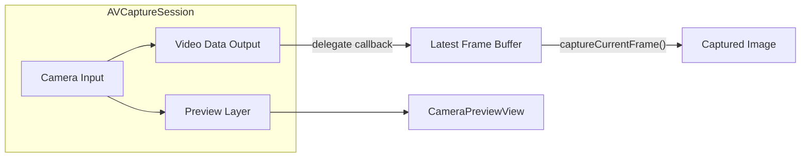

# Camera Preview Layer and Camera Manager

## Architecture

- **CameraManager**: Owns the capture session, requests camera permission, holds the latest frame from the video stream (thread-safe), and exposes `captureCurrentFrame()` to return a snapshot of that frame when the user taps Capture.
- **Preview**: SwiftUI-friendly view that displays the live camera feed via `AVCaptureVideoPreviewLayer`.
- **Flow**: One session with both a preview layer (for display) and a video data output (for frame callbacks). Each callback updates the "latest frame"; Capture reads it once and returns a copy.

## 1. Camera permission

- Add **camera usage description** so the system can prompt the user. The project uses `GENERATE_INFOPLIST_FILE = YES` (no standalone Info.plist). Add:
  - **Key**: `NSCameraUsageDescription`
  - **Value**: e.g. "This app uses the camera to capture photos."
- In Xcode: Target → IosTestApp → Info → add row "Privacy - Camera Usage Description", or in [project.pbxproj](apps/ios-test/IosTestApp.xcodeproj/project.pbxproj) add `INFOPLIST_KEY_NSCameraUsageDescription = "…";` under the IosTestApp target build settings.

## 2. CameraManager (new file)

- **Path**: [apps/ios-test/IosTestApp/CameraManager.swift](apps/ios-test/IosTestApp/CameraManager.swift) (create and add to the app target in Xcode).
- **Responsibilities**:
  - **AVCaptureSession** on a dedicated serial queue (e.g. `sessionQueue`).
  - **AVCaptureDeviceInput** for `.video` (default back camera).
  - **AVCaptureVideoPreviewLayer** is not owned by the manager; the manager exposes the **session** so the preview view can set `previewLayer.session = session`.
  - **AVCaptureVideoDataOutput** with `setSampleBufferDelegate(_:queue:)` on the same or another serial queue. In the delegate, convert `CMSampleBuffer` → `CVPixelBuffer` and store the latest buffer (see thread safety below).
  - **Latest frame storage**: Keep a single `CVPixelBuffer?` (or a `CGImage` if you prefer). Update it on every delegate call. Use a **lock** (e.g. `NSLock` or a serial queue) when reading/writing this property so the main thread can safely call `captureCurrentFrame()`.
  - **captureCurrentFrame()**: Under the lock, copy the current `CVPixelBuffer` (e.g. create a new buffer and copy the pixel data, or create a `CGImage` from it and return that). Return an optional `CGImage` (or `UIImage`) so SwiftUI can display or save it.
  - **Lifecycle**: `startSession()` (after permission check), `stopSession()`. Call `startSession()` from the view's `.onAppear` and `stopSession()` on `.onDisappear`.
  - **Permission**: Use `AVCaptureDevice.requestAccess(for: .video)` and expose an optional `@Published` auth status if you want to show "Camera denied" in the UI.
- **ObservableObject**: Conform to `ObservableObject`; optionally `@Published var capturedImage: CGImage?` (or `UIImage?`) so that when Capture is pressed you assign the result and the UI can show it (e.g. in a sheet or below the preview).

## 3. Camera preview view (SwiftUI)

- **Path**: [apps/ios-test/IosTestApp/CameraPreviewView.swift](apps/ios-test/IosTestApp/CameraPreviewView.swift) (create and add to target).
- **Implementation**: `UIViewRepresentable` wrapping a `UIView` whose `layer` is an `AVCaptureVideoPreviewLayer`.
  - In `makeUIView`: create the view, set `previewLayer.videoGravity = .resizeAspectFill`, and set `previewLayer.session = cameraManager.session` (manager passed in from the parent).
  - In `updateUIView`: update `previewLayer.session` if the manager's session changes, and in `layoutSubviews` (or via a `Coordinator` / `UIView` subclass) set `previewLayer.frame = bounds`.
  - The preview layer needs the session to be running to show the feed; the manager will start the session when the view appears.

## 4. ContentView (or dedicated camera screen)

- Replace or extend [apps/ios-test/IosTestApp/ContentView.swift](apps/ios-test/IosTestApp/ContentView.swift):
  - Add a `@StateObject` or `@ObservedObject` `CameraManager`.
  - **Layout**: `ZStack` or `VStack` with:
    - `CameraPreviewView(session: cameraManager.session)` filling the space (or a defined frame).
    - A **Capture** button overlaid (e.g. bottom center). On tap: call `cameraManager.captureCurrentFrame()` and store/display the returned image (e.g. set `capturedImage` on the manager or local `@State`).
  - **Lifecycle**: `.onAppear` → `cameraManager.startSession()`; `.onDisappear` → `cameraManager.stopSession()`.
  - Optional: show the last captured image in a small thumbnail or in a sheet; handle "no permission" with a message and disable the Capture button when unauthorized.

## 5. Thread safety and frame handling

- **Writer**: The video data output delegate runs on the queue you pass to `setSampleBufferDelegate`. In that callback, copy the pixel buffer (e.g. `CVPixelBufferCreateCopy` or create a `CGImage` from it) and then under the lock assign to the "latest frame" property. Do not hold the lock during pixel buffer creation.
- **Reader**: `captureCurrentFrame()` will be called from the main thread. Under the lock, read the current latest frame, create a copy (CGImage or CVPixelBuffer copy), release the lock, and return the copy. This way you always return "whatever was the latest frame at the moment of the tap."

## 6. Xcode project

- Add the new Swift files to the IosTestApp target: **CameraManager.swift** and **CameraPreviewView.swift** in the IosTestApp group, and add them to the target's "Compile Sources" build phase. This can be done by dragging the files into the project in Xcode, or by editing [project.pbxproj](apps/ios-test/IosTestApp.xcodeproj/project.pbxproj) (add `PBXFileReference`, `PBXBuildFile`, group membership, and `PBXSourcesBuildPhase` entries).

## 7. Documentation

- **Path**: [apps/ios-test/docs/](apps/ios-test/docs/) — create a `docs` subfolder inside `ios-test` (sibling to `IosTestApp`, `Config`, etc.).
- **File**: e.g. [apps/ios-test/docs/camera-architecture.md](apps/ios-test/docs/camera-architecture.md).
- **Content**: Write the camera architecture into this doc so it lives with the app (separate from the plan). Include:
  - **Overview**: One session, preview layer + video data output, latest-frame buffer, capture-on-tap.
  - **Architecture diagram**: The same mermaid flowchart (session → preview + data output → latest frame → capture).
  - **Components**: CameraManager, CameraPreviewView, ContentView — roles and responsibilities.
  - **Thread safety**: How the latest frame is written (data output queue) and read (main thread), and use of a lock.
  - **Summary table**: Component vs purpose (as in the plan Summary).
- Keeps the design discoverable in-repo and independent of Cursor's plan file.

## Summary

| Component                       | Purpose                                                                                                      |
| ------------------------------- | ------------------------------------------------------------------------------------------------------------ |
| **CameraManager**               | Session, permission, video data output, hold latest frame (locked), `captureCurrentFrame()` returns snapshot |
| **CameraPreviewView**           | UIViewRepresentable + AVCaptureVideoPreviewLayer to show live feed                                           |
| **ContentView**                 | Host preview + Capture button, lifecycle (start/stop session), display captured image                        |
| **Info**                        | NSCameraUsageDescription for permission prompt                                                               |
| **docs/camera-architecture.md** | In-repo architecture doc (overview, diagram, components, thread safety)                                      |

No new dependencies; uses only AVFoundation and SwiftUI.

## Git commits along the way

When executing the plan, create a git commit after each logical step so changes are incremental and easy to review or revert:

1. **After step 1 (Camera permission)**
  Commit: `ios-test: add camera usage description for capture`
2. **After steps 2 + 6 (CameraManager + add to Xcode)**
  Commit: `ios-test: add CameraManager with session and latest-frame capture`
3. **After step 3 + 6 (CameraPreviewView + add to Xcode)**
  Commit: `ios-test: add CameraPreviewView with AVCaptureVideoPreviewLayer`
4. **After step 4 (ContentView)**
  Commit: `ios-test: wire camera preview and Capture button in ContentView`
5. **After step 7 (Documentation)**
  Commit: `ios-test: add camera architecture doc to docs/`

(Step 6 is folded into the commits that introduce the new Swift files.)