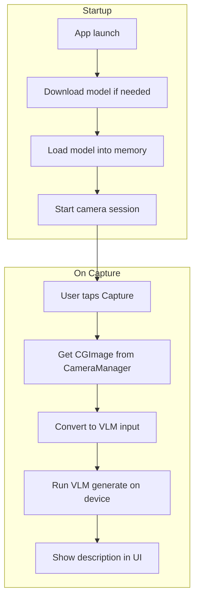

# 02 – Vision model load and camera description

## Goal

- **Manage and load a vision model in/out of memory**: first model is **mlx-community/qwen2-vl-2b-instruct-4bit**.
- **Startup**: Download the model (if needed), then load it into memory, then start the camera.
- **Capture flow**: When the user taps Capture, run the captured image through the model on device and show the model’s description of what it sees.

Existing app state: [ContentView](apps/ios-test/IosTestApp/ContentView.swift) and [CameraManager](apps/ios-test/IosTestApp/CameraManager.swift) already provide camera preview and `captureCurrentFrame()` returning a `CGImage`. The app already links **MLXLMCommon** and **MLXVLM** from mlx-swift-lm but does not use them yet. [IosTestApp.entitlements](apps/ios-test/IosTestApp/IosTestApp.entitlements) already has `com.apple.developer.kernel.increased-memory-limit` for large model memory.

---

## Architecture

- **Model lifecycle**: One “model manager” owns download (via `loadContainer`), load, and exposes inference (e.g. via `ModelContainer` + `ChatSession`). Optional later: unload on background / reload on foreground.
- **Camera**: Start after model is ready; on Capture, pass the captured `CGImage` into the model pipeline.

---

## 1. Model configuration and registry

- **Model id**: `mlx-community/qwen2-vl-2b-instruct-4bit`. Use **VLMRegistry.qwen2VL2BInstruct4Bit** from MLXVLM (id and default prompt already set).
- **Load**: `VLMModelFactory.shared.loadContainer(configuration: VLMRegistry.qwen2VL2BInstruct4Bit)` downloads from Hugging Face when not cached, then loads. Use **loadModelContainer** from MLXLMCommon so the trampoline resolves to VLMModelFactory.

---

## 2. Model manager (download + load at startup)

- **New file**: [apps/ios-test/IosTestApp/VisionModelManager.swift](apps/ios-test/IosTestApp/VisionModelManager.swift).
- **Responsibilities**:
  - Use `VLMRegistry.qwen2VL2BInstruct4Bit`; call `loadModelContainer(configuration:)` (or equivalent that returns `ModelContainer`) on a background task.
  - Expose state: `enum State { case notLoaded, loading, ready(ModelContainer), error(Error) }` (or equivalent) and publish on main actor for SwiftUI.
  - Expose a way to run inference: either expose the container (so ContentView can create `ChatSession(container)`) or expose a `describe(image:)` method that uses the container internally.
- **Lifecycle**: Start load from root view `.onAppear` or app init. Do not start camera until state is `ready`.

---

## 3. Startup order: model first, then camera

- **ContentView**: Depends on `VisionModelManager` (e.g. `@StateObject` created at app level and passed in or via environment).
- When model state is **loading**: Show “Downloading/loading model…” (no camera).
- When model state is **ready**: Call `cameraManager.startSession()` and show camera UI.
- When model state is **error**: Show error message and option to retry.
- Keep `onDisappear` → `cameraManager.stopSession()`.

---

## 4. Capture → inference → description

- **Input**: `CameraManager.captureCurrentFrame()` returns `CGImage?`. Convert to `CIImage` with `CIImage(cgImage: cgImage)` and use `UserInput.Image.ciImage(ciImage)`.
- **Prompt**: Use “Describe what you see in this image in one or two sentences.” (or the model’s default from config).
- **Inference**: Create `ChatSession(container)` and call `session.respond(to: prompt, image: .ciImage(ciImage))` in an async task. Run off main thread; update UI on main actor when done.
- **UI**: In the existing capture sheet, show the captured image and below it: loading indicator while inferring, then the description text (or error).

---

## 5. Files to add or change

| Item | Action |
|------|--------|
| **VisionModelManager.swift** | Create; load via `loadModelContainer` with `VLMRegistry.qwen2VL2BInstruct4Bit`; expose State and container/session. |
| **ContentView.swift** | Integrate model manager; gate camera on model ready; on Capture run inference and show description in sheet. |
| **IosTestAppApp.swift** | Create `@StateObject` VisionModelManager and pass to ContentView (or inject via environment). |
| **project.pbxproj** | Add VisionModelManager.swift to IosTestApp target. |
| **apps/ios-test/docs/vision-model-flow.md** | New doc: startup order, model id, capture → inference → description. |

No new SPM dependencies.

---

## 6. Commit points

1. **ios-test: add VisionModelManager and Qwen2-VL-2B-4bit config**  
   New VisionModelManager.swift, add to target. No UI wiring yet.

2. **ios-test: gate camera on model ready and show model loading UI**  
   ContentView uses model manager; starts camera only when model is ready; shows loading/error UI until then.

3. **ios-test: run capture through VLM and show description**  
   On Capture: convert CGImage to UserInput.Image, call ChatSession.respond, show description in sheet with loading/error states.

4. **ios-test: document vision model flow and startup order**  
   Add docs/vision-model-flow.md.

---

## 7. Optional follow-ups (out of scope)

- Unload model when app backgrounds, reload when foregrounded.
- Show download/load progress if the API exposes it.
- Stream tokens as they arrive.
