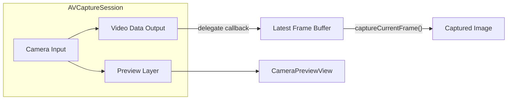

# Camera architecture

## Overview

The camera feature uses a single `AVCaptureSession` with:

- A **preview layer** for the live feed on screen.
- A **video data output** that receives each frame; we keep the latest frame in a buffer.
- When the user taps **Capture**, we return a copy of whatever frame is currently in that buffer.

So the user sees the live preview and can grab the current frame at any time without a separate photo pipeline.

## Architecture diagram

## Components

| Component | Responsibility |
|-----------|----------------|
| **CameraManager** | Owns the capture session; requests camera permission; configures camera input and video data output; holds the latest frame (thread-safe); exposes `captureCurrentFrame()` to return a snapshot of that frame; lifecycle `startSession()` / `stopSession()`. |
| **CameraPreviewView** | SwiftUI `UIViewRepresentable` that wraps a view whose layer is an `AVCaptureVideoPreviewLayer`; displays the manager’s session; keeps the preview layer’s frame in sync with the view bounds. |
| **ContentView** | Hosts the preview and Capture button; creates and owns the `CameraManager`; calls `startSession()` on appear and `stopSession()` on disappear; shows the captured image in a sheet; shows an “unauthorized” state with a link to Settings when camera access is denied. |

## Thread safety

- **Writer**: The video data output delegate runs on the queue passed to `setSampleBufferDelegate` (a dedicated serial queue). In that callback we copy the pixel buffer (so we don’t hold the system’s buffer), then under a lock we assign the copy to the “latest frame” property. We do not hold the lock during the copy.
- **Reader**: `captureCurrentFrame()` is called from the main thread (e.g. when the user taps Capture). Under the same lock we read the current latest frame, create a `CGImage` copy from it, release the lock, and return the copy. So we always return whatever was the latest frame at the moment of the tap.

## Summary

| Component | Purpose |
|-----------|--------|
| **CameraManager** | Session, permission, video data output, hold latest frame (locked), `captureCurrentFrame()` returns snapshot |
| **CameraPreviewView** | UIViewRepresentable + AVCaptureVideoPreviewLayer to show live feed |
| **ContentView** | Host preview + Capture button, lifecycle (start/stop session), display captured image |
| **Info** | NSCameraUsageDescription for permission prompt |

No extra dependencies; uses AVFoundation and SwiftUI only.
